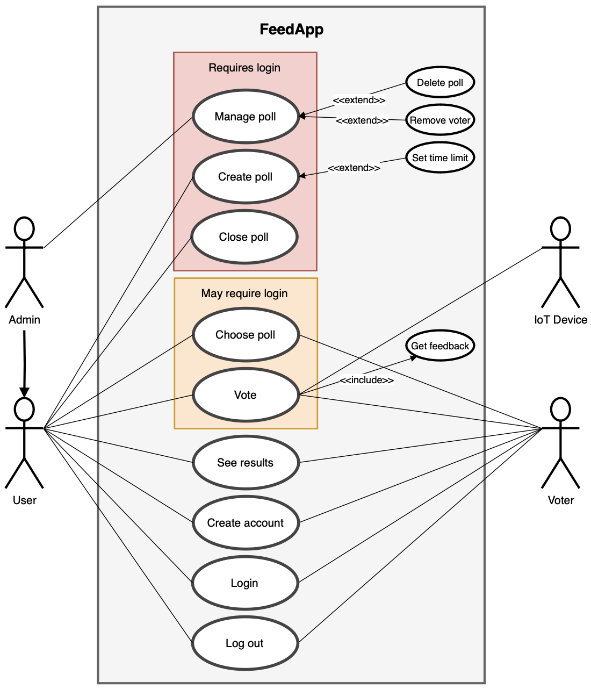
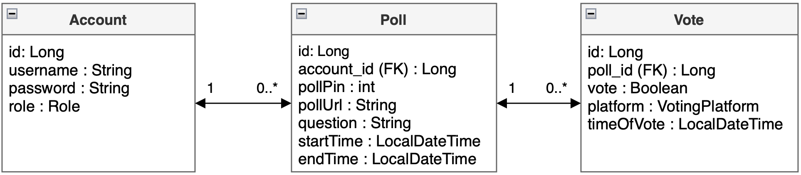

# Design document

  

### Group members

Beate Skogvik, Rita Haveland Borlaug, and Sunniva Storetvedt Lothe

### Appassignment A

- Use case diagrams
- A domain model for the application
- Application flow diagrams for the front-end
- Mock-up user screens for the front-end
- A system-specific architectural diagram

# The FeedApp Assignment

FeedApp is an IoT-cloud software system in which users can provide feedback through binary yes/no votes on polls, either via a web-client front-end or via an IoT-voting device.

## Use cases and use case diagrams

Use cases for this application includes:
- Manage poll
- Create poll
- Close poll
- Choose poll
- Vote
- See results
- Create account
- Login
- Log out

Our system recognizes three primary actors: admin, user and voter. All three roles can decide to vote on polls. An actor can choose a poll three different ways:
1. Choosing a poll amongst the public polls that has been created in the FeedApp.
2. Via a unique number that is automatically generated for each poll. These polls can either be public or private.
3. Via a url that is automatically generated for each poll. These polls can also be either public or private.

The difference between a user and a voter is that a voter cannot create polls, but the user can. The difference between user and admin is that the admin can manage the polls. This includes the option to delete polls and remove voters from the polls.

The figure below displays the use case diagram for our application:

## Domain Model

The domain model for the application FeedApp displays the three conceptual classes and their attributes.

## Application flow diagram (front-end)

The application flow diagram for the front-end web-client:

## Mock-up user screens (front-end)

The layout for the web-client:

## System-specific architectural diagram

The system consists of the following elements:

