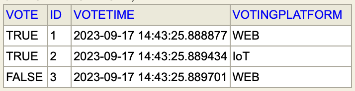

# Design document 

#### Group members 

Rita Haveland Borlaug, Sunniva Storetvedt Lothe, Beate Skogvik

#### Appassignment A 

- A domain model for the application
- Use case diagrams
- Application flow diagrams for the front-end
- Mock-up user screens for the front-end
- A system-specific architectural diagram similar to Chap 1 in the IoT book (see Canvas) that relate the FeedApp application to the IoT-levels (Fig 1.14 - 1.19).

# Feed App 

FeedApp´s primary purpose is to facilitate polls for feedback through web, mobile, or IoT devices. 

## Domain Model 

## Use case diagrams

## Application flow diagram (front-end)

## Mock-up user screens (front-end)

## System-specific architectural diagram