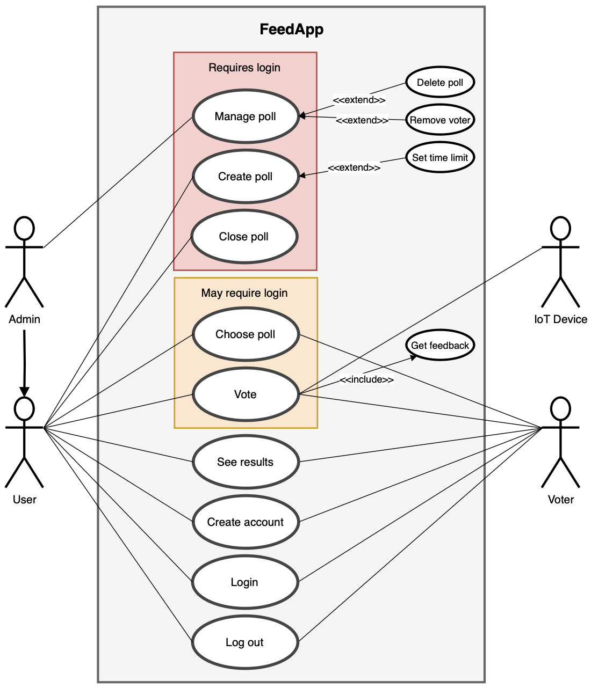
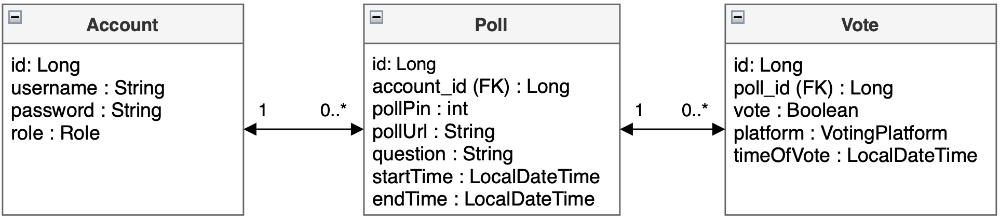
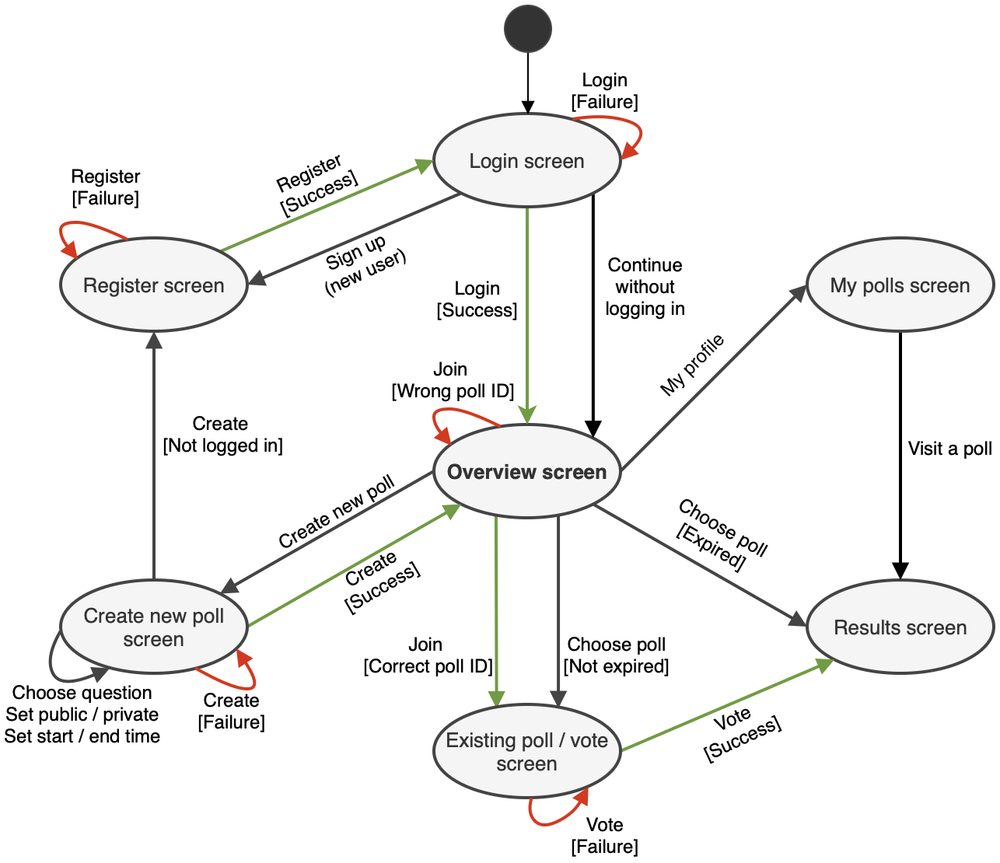
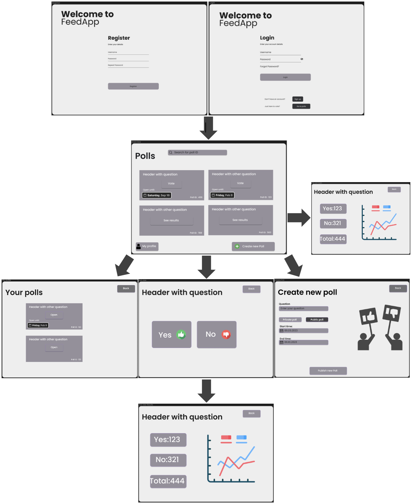
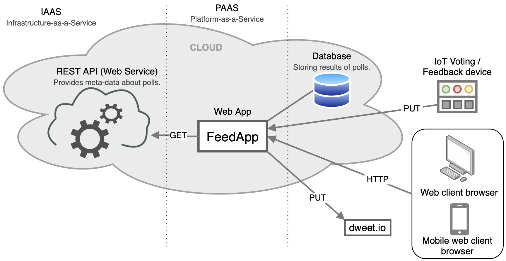

## FeedApp 

FeedApp is an IoT-cloud software system in which users can provide feedback through binary yes/no votes on polls, either via a web-client front-end or via an IoT-voting device.

### Group members
Beate Skogvik, Rita Haveland Borlaug, and Sunniva Storetvedt Lothe

## Table of content:
 - [Project structure](#item-one)
 - [About the project structure](#item-two)
 - [Design document](#item-three)
   - [Use cases and use case diagram](#item-four)
   - [Domain model](#item-five)
   - [Application flow diagram](#item-six)
   - [Mock-up user screens](#item-seven)
   - [System-specific architectural diagram](#item-eight)

<!-- headings -->

## Project structure

src/main/java/no/hvl/dat250/feedapp
* model
  * Account.java
  * Poll.java
  * Vote.java
  * Role.java
  * VotingPlatform
  * PollPrivacy.java
* controller
  * AccountController.java
  * PollController.java
  * VoteController.java
* repository
  * AccountRepository.java
  * PollRepository.java
  * VoteRepository.java
* service
  * implementation
    * AccountServiceImpl.java
    * PollServiceImpl.java
    * VoteServiceImpl.java
  * AccountService.java
  * PollService.java
  * VoteService.java
* exception
  * ExceptionDetails.java
  * GlobalExceptionHandler.java
  * ResourceNotFoundException.java
  * BadRequestException.java
  * InternalServerErrorException.java
  * UnauthorizedAccessException.java
* iotSimulation
  * DweetIoTSimulation.java
* resources
  * diagrams
  * static
  * templates
  * application.properties
* FeedappApplication.java

src/test
* FeedAppApplicationTests.java

## About the project structure

### Model
This layer contains entity classes (like Account, Poll, Vote) that represent the data structures of the application. These are mapped to database tables and are used for data storage and retrieval.
* Role contains ADMIN, USER, VOTER, IoT_DEVICE to define the role of the actor in our system.
* VotingPlatform contains IoT, WEB to define if the voter used a web-client front-end or an IoT voting device.
* PollPrivacy contains PUBLIC, PRIVATE to define if a poll is public (for all) or private (for users and admin only).

### Controller
The controller layer contains classes for handling incoming HTTP requests and defining the RESTful endpoints of the API. These classes contains methods for creating, reading, updating, and deleting resources (CRUD operations) using the services layer.

### Repository
The repository layer contains classes that provide an abstraction over database operations. They allow us to perform database CRUD operations without writing SQL queries directly. These are implemented using Spring Data JPA.
In this project we use the JPA provided repository methods, for the most part.

### Service
The service layer contains business logic that operates on the data provided by the controllers. It encapsulates complex operations, validation, and transactions. The service classes mediate between the controllers and repositories, providing a separation of concerns and improving the maintainability of the code.

#### Implementation sub layer
The implementation subpackage contains classes that implement the service interfaces.

### Exception
The exception layer is responsible for handling exceptions and errors gracefully within the application, in such a way that the client gets to know what worked and did not work.
* Exception classes such as ResourceNotFoundException, BadRequestException, InternalServerErrorException, and UnauthorizedAccessException are custom exception types that we can throw in the code to handle specific error cases.
* The GlobalExceptionHandler is responsible for handling exceptions globally throughout this project.

### IoTSimulation
The DweetIoTSimulation is simulating a "thing" to test how the application handles IoT data.

### Resources
This directory typically contains static resources (like HTML, CSS, JavaScript files), templates for rendering dynamic views, and configuration files (such as application.properties for Spring Boot configuration).

### FeedappApplication
This is the entry point of the Spring Boot application. It contaisn the main method and is responsible for starting the application.

### Test
This directory contains test classes that are used to test the application's functionality. Testing is cruicial to ensure the correctness and reliability of the code.

## Design document

### Use cases and use case diagrams 
Use cases for this application includes:
- Manage poll
- Create poll
- Close poll
- Choose poll
- Vote
- See results
- Create account
- Login
- Log out

Our system recognizes four primary actors: admin, user, voter and IoT device. All four roles can decide to vote on polls. An actor can choose a poll three different ways:
1. Choosing a poll amongst the public polls that has been created in the FeedApp.
2. Via a unique number that is automatically generated for each poll. These polls can either be public or private.
3. Via a url that is automatically generated for each poll. These polls can also be either public or private.

The difference between a user and a voter is that a voter cannot create polls, but the user can. The difference between user and admin is that the admin can manage the polls. This includes the option to delete polls and remove voters from the polls.

### Domain Model

  

### Application flow diagram (front-end)

  

### Mock-up user screens (front-end)

  

### System-specific architectural diagram

  

## Trello

[Trello](https://trello.com/b/sKPuLBzR/dat250)

## Docker compose 

- Docker compose is used to run the application in a containerized environment, with both the application and the database(mongoDB) running in separate containers.
- to use docker compose, run the following command in the `feedapp-2` directory of the project: `docker-compose up`
- If u dont have docker compose installed, run `brew install docker-compose` in the terminal. (MacOS)

## MongoDB 

- MongoDB is used as the NoSQL database for this project.
- To access the database in the mongoshell, run the following command: `docker exec -it feedapp-2-mongo-1 mongosh`
- Where `feedapp-2-mongo-1` is the name of the container running the database.
- The field `_id: ObjectId` is automatically generated by MongoDB when a document is created.

*Commands inside the mongoshell:*
- `show dbs` - shows all databases
- For now our db is called `feedappdb`

- `use feedappdb` - to switch to the database

- `show collections` - shows all collections in the database
- At this moment the collection we have is `pollResult`

- `db.pollResult.find()` - shows all documents in the collection

