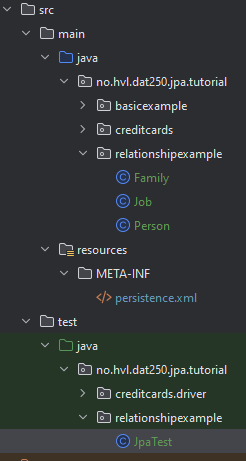

# Experiment 2 tests

[](../../actions/workflows/main.yml)

1. Activate the automatic tests on commit under the Actions tab. 
2. **Make sure that the test suite located under src/test/java runs successfully after your implementation!**
3. A green tick should appear next to your commit in the GitHub repository since test cases are executed upon code changes. You can check those runs under the Actions tab.

# JPA tutorial

1. The class **_Main_** should run and terminate without errors. Make sure you have imported the maven project defined in the `pom.xml`.
2. Create a new package `relationshipexample` under `no.hvl.dat250.jpa.tutorial`.
3. Create the following three classes **Family**, **Job**, and **Person** in the new package:

```java
package no.hvl.dat250.jpa.tutorial.relationshipexample;

import jakarta.persistence.Entity;
import jakarta.persistence.GeneratedValue;
import jakarta.persistence.GenerationType;
import jakarta.persistence.Id;
import jakarta.persistence.OneToMany;
import java.util.ArrayList;
import java.util.List;
import lombok.Getter;
import lombok.NoArgsConstructor;
import lombok.Setter;

@Getter
@Setter
@NoArgsConstructor
@Entity
public class Family {
  @Id
  @GeneratedValue(strategy = GenerationType.IDENTITY)
  private Long id;
  private String description;

  @OneToMany(mappedBy = "family")
  private final List<Person> members = new ArrayList<>();

}
```

```java
package no.hvl.dat250.jpa.tutorial.relationshipexample;


import jakarta.persistence.Entity;
import jakarta.persistence.GeneratedValue;
import jakarta.persistence.GenerationType;
import jakarta.persistence.Id;
import lombok.Getter;
import lombok.NoArgsConstructor;
import lombok.Setter;

@Entity
@Getter
@Setter
@NoArgsConstructor
public class Job {
  @Id
  @GeneratedValue(strategy = GenerationType.IDENTITY)
  private Long id;
  private double salary;
  private String jobDescr;

}
```

```java
package no.hvl.dat250.jpa.tutorial.relationshipexample;

import jakarta.persistence.Entity;
import jakarta.persistence.GeneratedValue;
import jakarta.persistence.GenerationType;
import jakarta.persistence.Id;
import jakarta.persistence.ManyToOne;
import jakarta.persistence.OneToMany;
import jakarta.persistence.Transient;
import java.util.ArrayList;
import java.util.List;
import lombok.Getter;
import lombok.NoArgsConstructor;
import lombok.Setter;

@Getter
@Setter
@NoArgsConstructor
@Entity
public class Person {
  @Id
  @GeneratedValue(strategy = GenerationType.IDENTITY)
  private Long id;
  private String firstName;
  private String lastName;

  @ManyToOne
  private Family family;

  @Transient
  private String nonsenseField = "";

  @OneToMany
  private List<Job> jobList = new ArrayList<>();
}
```
The file `persistence.xml` in `src/main/resources/META-INF` is configured to automatically map them to database tables using **[Hibernate](https://hibernate.org/orm/)**. Have a look at the `persistence.xml` and try to roughly understand its content.

- Can you find out which database is used and where the database stores its files?

4. Now add the following JUnit test _**JpaTest**_ under `src/test/java` in a new package `no.hvl.dat250.jpa.tutorial.relationshipexample`:
```java
package no.hvl.dat250.jpa.tutorial.relationshipexample;

import static org.junit.Assert.assertEquals;

import jakarta.persistence.EntityManager;
import jakarta.persistence.EntityManagerFactory;
import jakarta.persistence.Persistence;
import jakarta.persistence.Query;

import org.junit.Before;
import org.junit.Test;

public class JpaTest {

    private static final String PERSISTENCE_UNIT_NAME = "jpa-tutorial";
    private EntityManagerFactory factory;

    @Before
    public void setUp() {
        factory = Persistence.createEntityManagerFactory(PERSISTENCE_UNIT_NAME);
        EntityManager em = factory.createEntityManager();

        // Begin a new local transaction so that we can persist a new entity
        em.getTransaction().begin();

        // read the existing entries
        Query q = em.createQuery("select m from Person m");
        // Persons should be empty

        // do we have entries?
        boolean createNewEntries = (q.getResultList().size() == 0);

        // No, so lets create new entries
        if (createNewEntries) {
            assertEquals(0, q.getResultList().size());
            Family family = new Family();
            family.setDescription("Family for the Knopfs");
            em.persist(family);
            for (int i = 0; i < 40; i++) {
                Person person = new Person();
                person.setFirstName("Jim_" + i);
                person.setLastName("Knopf_" + i);
                person.setFamily(family);
                // now persists the family person relationship
                family.getMembers().add(person);
                em.persist(person);
                em.persist(family);
            }
        }

        // Commit the transaction, which will cause the entity to
        // be stored in the database
        em.getTransaction().commit();

        // It is always good practice to close the EntityManager so that
        // resources are conserved.
        em.close();

    }

    @Test
    public void checkAvailablePeople() {

        // now lets check the database and see if the created entries are there
        // create a fresh, new EntityManager
        EntityManager em = factory.createEntityManager();

        // Perform a simple query for all the Message entities
        Query q = em.createQuery("select m from Person m");

        // We should have 40 Persons in the database
        assertEquals(40, q.getResultList().size());

        em.close();
    }

    @Test
    public void checkFamily() {
        EntityManager em = factory.createEntityManager();
        // Go through each of the entities and print out each of their
        // messages, as well as the date on which it was created
        Query q = em.createQuery("select f from Family f");

        // We should have one family with 40 persons
        assertEquals(1, q.getResultList().size());
        assertEquals(40, ((Family) q.getSingleResult()).getMembers().size());
        em.close();
    }

    @Test(expected = jakarta.persistence.NoResultException.class)
    public void deletePerson() {
        EntityManager em = factory.createEntityManager();
        // Begin a new local transaction so that we can persist a new entity
        em.getTransaction().begin();
        Query q = em
                .createQuery("SELECT p FROM Person p WHERE p.firstName = :firstName AND p.lastName = :lastName");
        q.setParameter("firstName", "Jim_1");
        q.setParameter("lastName", "Knopf_!");
        Person user = (Person) q.getSingleResult();
        em.remove(user);
        em.getTransaction().commit();
        Person person = (Person) q.getSingleResult();

        em.close();
    }
}
```
5. Run all tests. They should all **succeed**.
 
The `setUp()` method will create a few test entries. After the test entries are created, they will be read/deleted during the tests.

- Where do the getters/setters used in the `setUp()` method come from?

6. The **final project** should look like this:



## Acknowledgements
This tutorial is partly based on https://www.vogella.com/tutorials/JavaPersistenceAPI/article.html#example.
